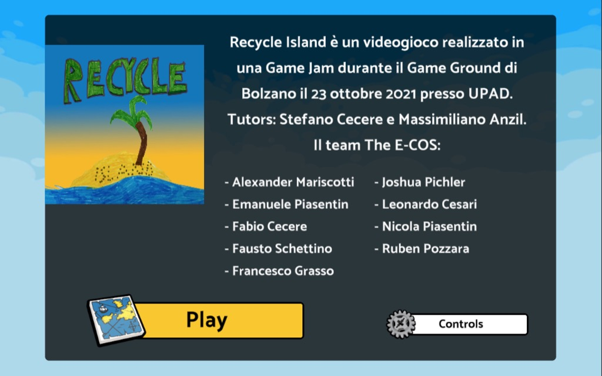

---
lastmod: 2021-11-02T12:47:10
---
# Recycle Island - GameGround Kids Game Jam



Recycle Island è un videogioco realizzato da nove giovanissimi in una giornata di Game Jam durante il festival dei videogiochi [Game Ground](https://www.gameground.it/) a Bolzano il 23 ottobre 2021 presso la Fondazione [UPAD](https://www.upad.it/).

Il tema della Jam era "**Eco-sostenibilità e ambiente"**.
Potete vedere le slides della presentazione: [Introduzione](./_docs/GameGround%20Jam%20-%20introduzione.pdf)

La scheda del gioco con la versione scaricabile per PC è qui: [gameground.itch.io](https://gameground.itch.io/recycledisland)  

## Installare il progetto

### Unity
Questo gioco è sviluppato con Unity, uno strumento professionale che è però gratuito per uso personale e studenti.  
Usiamo la versione **2020.3 LTS**  
Potete scaricarlo da qui [https://unity.com/download](https://unity.com/download)
Servirà poi creare un account personale.

### GitHub
Scaricherete poi tutto questo progetto, da qui [https://github.com/jamurr/GameGroundJAM/archive/refs/heads/master.zip](https://github.com/jamurr/GameGroundJAM/archive/refs/heads/master.zip)

Se siete pratici di Git da qui: [https://github.com/jamurr/GameGroundJAM.git](https://github.com/jamurr/GameGroundJAM.git)

### LEGO microgame
Il gioco uso il sistema della LEGO, troverete la documentazione qui: [_docs](./_docs/)

### Lanciare il gioco
Aprite la cartella ```GameGroundJAM_Unity``` con Unity 2020.3 e poi la scena ```/_game/Game```

